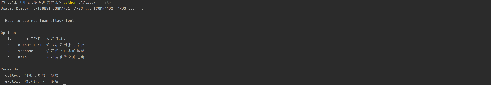
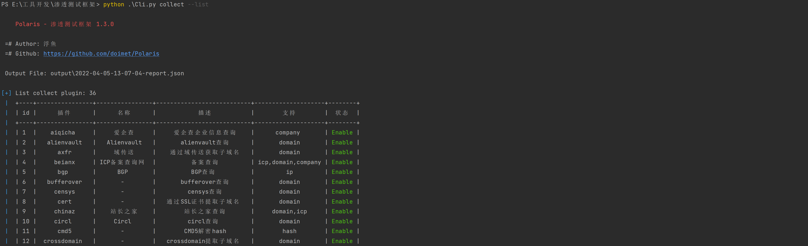
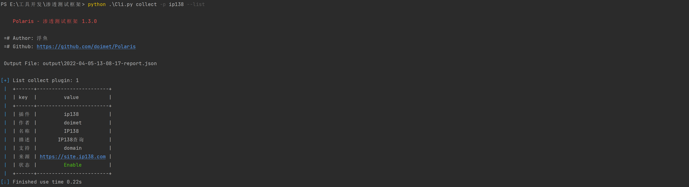
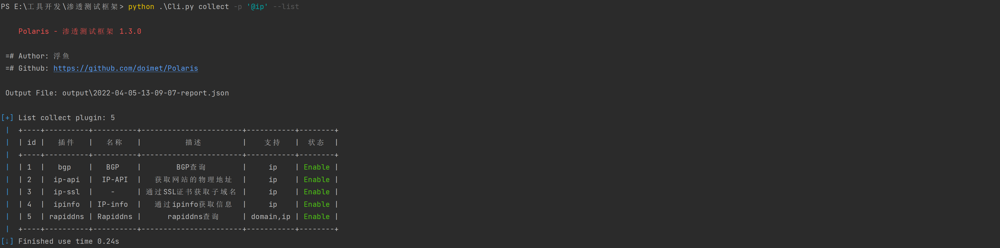
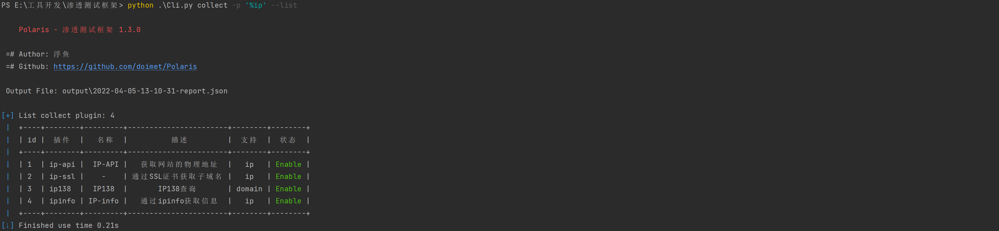
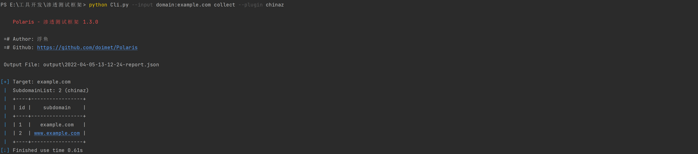
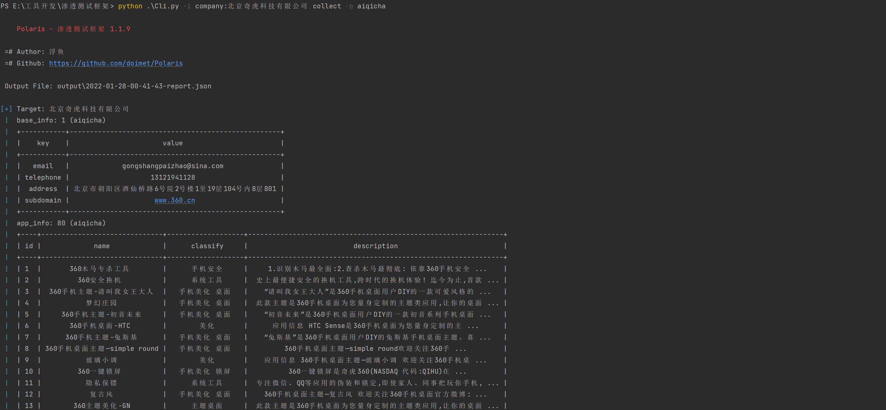

<h1 align="center">🌟Polaris</h1>
<h1 align="center">

[](https://www.python.org/)
[](https://raw.githubusercontent.com/doimet/Fish/master/docs/LICENSE)
[](https://github.com/doimet)
</h1>

# 项目简介
这是一款集信息收集、漏洞利用、漏洞爆破等功能的一体化渗透测试框架   

它的优点:
- 兼容XRay语法规则
- 可从本地文件加载目标
- 各模块即可单独调用，也可以自由组合
- 插件提供命令交互接口、异步方法调用...
- 线程异步可控
- 界面美观舒适

# 使用帮助

+ 修改配置文件
    ```
    conf/setting.toml
    ```
    配置文件里配置了程序运行的必要参数以及插件的参数, 按需修改即可
+ 安装支持类库
    ```shell script
    pip3 install -r requirements.txt -i https://pypi.douban.com/simple/
    ```
+ 查看帮助信息
    ```shell script
    python Cli.py --help
    ```
    
    ```shell script
    python Cli.py {命令} --help
    ```
    
    可选命令: `collect`、`exploit`、`login`、`auxiliary`
+ 查看插件信息
    + 列出所有插件
        ```shell script
        python Cli.py {命令} --list
        ```
        
    + 按名称筛选插件
        ```shell script
        python Cli.py {命令} --plugin '{插件}' --list
        ```
        
    + 按类型筛选插件
        ```shell script
        python Cli.py {命令} --plugin '@{类型}' --list
        ```
        
    + 排除指定插件
        ```shell script
        python Cli.py {命令} --plugin '!{插件}' --list
        ```
        
        可选类型: `ip`、`domain`、`subdomain`、`url`、`company`、`email`、`md5`等
    + 模糊匹配插件
        ```shell script
        python Cli.py {命令} --plugin '%{插件}' --list
        ```
+ 运行命令格式
    ```shell script
    python Cli.py --input {类型}:{目标/文件} {调用命令} {调用参数}
    ```
    
    可选输出文件类型: `json`
## 使用示例

### 收集信息

+ 收集子域名
    ```shell script
    python Cli.py --input domain:example.com collect
    python Cli.py --input domain:example.com collect --plugin china
    python Cli.py --input domain:example.com collect --plugin china --plugin ip138
    python Cli.py --input domain:example.com collect --plugin !ksubdomain
    python Cli.py --input dork:184.173.106.60 collect --plugin zoomeye --console
    ```
    
+ 收集ip信息
    ```shell script
    python Cli.py --input ip:x.x.x.x collect
    ```
+ 收集邮箱
    ```shell script
    python Cli.py --input email:xxx@gmail.com collect
    ```
+ 收集公司信息
    ```shell script
    python Cli.py --input company:北京奇虎科技有限公司 collect --plugin aiqicha
    ```
    

### 扫描功能

+ 端口扫描
    ```shell script
    python Cli.py --input ip:x.x.x.x xscan -p portscan
    ```
  
### 漏洞利用
```shell script
python Cli.py --input url:http://example.com exploit
python Cli.py --input url:http://example.com exploit --plugin CVE-2021-22205
python Cli.py --input url:http://example.com exploit --plugin CVE-2021-22205 --console
```
指定`console`参数可进入交互模式
### 口令爆破

```shell script
python Cli.py --input ip:x.x.x.x login
python Cli.py --input ip:x.x.x.x login --plugin ssh
python Cli.py --input ip:x.x.x.x login --plugin ssh --console
```

### 渗透辅助
+ MD5解密
```shell script
python Cli.py --input md5:1a79a4d60de6718e8e5b326e338ae533 tools --plugin md5
```
+ 识别杀软
```shell script
python Cli.py --input file:tasklist.txt tools --plugin whatav
```

### 命令联动
```shell script
python Cli.py --input domain:example.com collect --plugin ip138 exploit --plugin CVE-2021-xxx 
```

## 插件开发
[插件开发手册](docs/DEVELOPMENT.md)

## 版本日志
[版本修改日志](docs/CHANGELOG.md)

## 使用声明
本工具仅用于安全测试目的   
用于非法用途与开发者无关   
